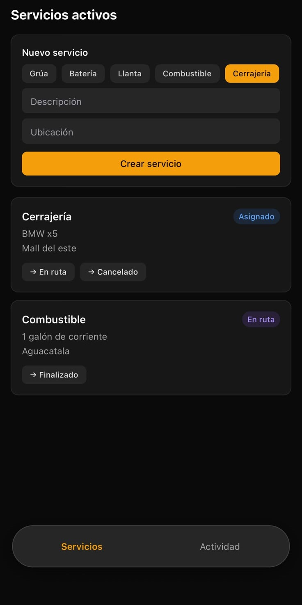
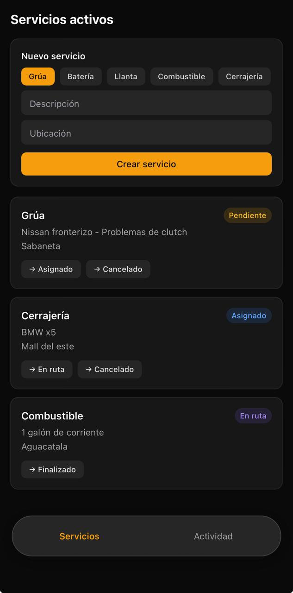
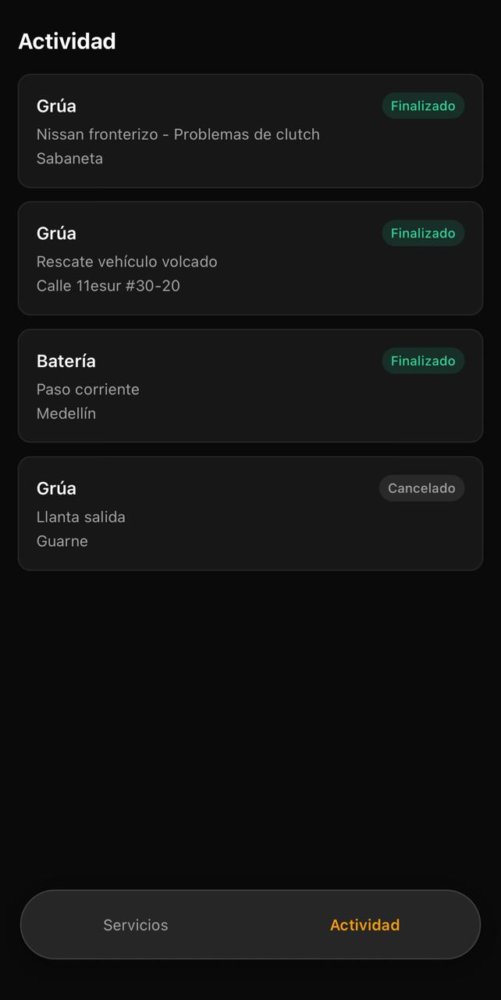
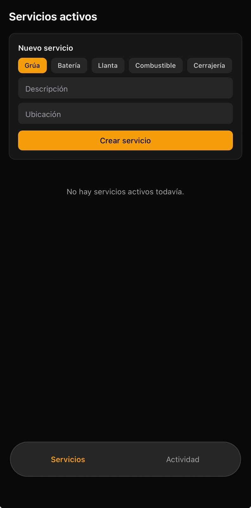

# Asistencia Vial — Prueba técnica Solvy

App para gestionar solicitudes de asistencia vial (grúa, batería, llanta, combustible,
cerrajería): se crean, se listan y avanzan por un ciclo de estados controlado por reglas
de dominio (`PENDIENTE → ASIGNADO → EN_RUTA → FINALIZADO`, con `CANCELADO` permitido solo
desde `PENDIENTE` o `ASIGNADO`).

Monorepo con dos partes:

- **`backend/`** — API en NestJS, arquitectura hexagonal, Prisma + SQLite.
- **`mobile/`** — App en Expo (React Native + NativeWind) que consume el backend.

## Stack

| Parte | Stack |
|---|---|
| Backend | NestJS · Prisma · SQLite |
| Móvil | Expo · React Native · NativeWind · Zod |

## Cómo correrlo

**1. Backend** (detalle completo en [`backend/README.md`](backend/README.md)):

```bash
cd backend
npm install
cp .env.example .env
npx prisma migrate dev
npm run start:dev        # http://localhost:3000
```

**2. Móvil** (detalle completo en [`mobile/README.md`](mobile/README.md)):

```bash
cd mobile
cp .env.example .env     # pon la IP LAN de tu computador (ver ipconfig)
npm install
npm run start             # escanea el QR con Expo Go
```

## Arquitectura

Ambas partes siguen la misma regla de dependencia: todo apunta hacia el dominio, nunca al
revés.

```text
infraestructura  ──depende de──▶  aplicación  ──depende de──▶  dominio
(HTTP, Prisma)                   (casos de uso)               (Servicio, reglas)
```

- **Backend**: `domain/` (entidad `Servicio`, enums, reglas de transición, errores, puerto
  `ServicioRepository`) → `application/` (casos de uso, clases TypeScript planas sin
  imports de NestJS) → `infrastructure/` (Prisma, controller, DTOs, exception filter).
- **Móvil**: `domain/` (schemas Zod) → `data/` (cliente HTTP) → `state/` (Context + hook)
  → `ui/` (pantallas y componentes).

## Decisiones de arquitectura

| Decisión | Qué elegí | Por qué | Alternativa descartada |
|---|---|---|---|
| Alcance del módulo | Crear + listar + cambiar estado (no edición de campos libres) | La única mutación con reglas de negocio reales es el estado; editar campos no aporta nada que evaluar en la arquitectura | Edición completa de campos — menos foco en el dominio |
| Puerto del repositorio | Interfaz `ServicioRepository` definida en `domain/ports/`, con un solo método `guardar()` (sirve para crear y actualizar) | El dominio declara lo que necesita de persistencia; menos métodos en el puerto = menos superficie que implementar | Métodos separados `crear()`/`actualizar()` — redundante para el mismo shape de datos |
| Casos de uso sin `@Injectable()` | Clases TypeScript planas; NestJS los conecta con `useFactory` en `servicios.module.ts` | La capa de aplicación no importa nada de `@nestjs/*`; el wiring con el framework queda aislado en infraestructura | Decorar los casos de uso con `@Injectable()` — es el patrón más común, pero acopla la aplicación al framework sin necesidad |
| `tipo`/`estado` en SQLite | Se guardan como `String`, no como enum nativo de Prisma | El conector SQLite de Prisma no soporta enums; el adaptador castea hacia/desde los enums del dominio al leer/escribir | Forzar un enum de Prisma — no es posible con este motor de base de datos |
| Errores de dominio → HTTP | Excepciones propias (`TransicionEstadoInvalidaError`, `ServicioNoEncontradoError`) capturadas por un `ExceptionFilter` en infraestructura | El dominio lanza errores con significado de negocio, sin saber qué es un código HTTP; infraestructura decide el mapeo (409, 404) | Errores genéricos o un tipo `Result` — más ceremonia sin beneficio real a esta escala |
| Tests de casos de uso | Repositorio fake en memoria (array), no mocks de Jest | Prueba comportamiento real entre casos de uso (crear → listar ve lo creado), no solo que se llamó una función | `jest.fn()` con retornos configurados — más verboso, prueba llamadas en vez de comportamiento |
| Validación en 3 capas | class-validator (forma del request) → dominio (invariantes de negocio) → Zod en móvil (formulario + respuesta) | Cada capa valida solo lo que le compete; el móvil no confía ciegamente en que el backend nunca cambia de forma | Validar todo solo en el backend — el móvil quedaría sin defensa ante una respuesta inesperada |
| Estado en el móvil | Context + hook (`useServicios`) | Una sola pantalla con tres acciones no justifica una librería de estado global | Redux/Zustand — abstracción de más para este alcance |
| Tests del móvil | Capa de datos (cliente HTTP con `fetch` mockeado) | No depende de renderizar componentes; cubre el punto más fácil de romper sin darse cuenta (parseo, status codes) | Testing de componentes con React Native Testing Library — más fricción de setup para el mismo valor aquí |
| Botones de cambio de estado en la UI | `transicionesPermitidas(estado)` en `mobile/src/servicios/domain/`, espejo de la tabla del backend, en un solo lugar | La UI solo debe *guiar* al usuario mostrando acciones que tienen sentido; el backend sigue siendo la única fuente de verdad que valida y rechaza — un `curl` directo con una transición inválida sigue devolviendo 409 | Mostrar siempre los 4 estados restantes y dejar que el backend rechace — funciona, pero ofrece acciones destinadas a fallar, mala UX |
| Navegación por pestañas | `useState<'servicios' \| 'actividad'>` en `App.tsx` + un `TabBarInferior` propio | Son 2 pestañas planas, sin navegación anidada ni deep-linking; un estado local resuelve el 100% del alcance sin dependencias nuevas, justo antes de la defensa (menos riesgo de romper algo de última hora) | `expo-router` con tabs de archivo — es "lo oficial", pero trae ~5 dependencias nuevas y reestructura el entry point para un caso que no necesita esa potencia |
| Filtro Activos/Actividad | `esServicioActivo`/`esServicioHistorial` en `domain/categoria-servicio.ts`; el hook `useServicios()` expone `serviciosActivos` y `serviciosHistorial` ya filtrados con `useMemo` sobre el mismo array | Un solo fetch, un solo array de estado; las dos pestañas son vistas derivadas, no dos fuentes de datos independientes — evita que se desincronicen | Un fetch/estado separado por pestaña — duplicaría la llamada al backend y el estado de carga/error sin necesidad |
| Pestaña Actividad de solo lectura | No se agregó ninguna prop "modo lectura" a `TarjetaServicio` | `FINALIZADO` y `CANCELADO` son estados terminales: `transicionesPermitidas()` ya devuelve `[]` para ambos, así que la tarjeta no renderiza botones de acción automáticamente — la regla de dominio del Bloque 2 ya resuelve esto gratis | Una prop `soloLectura` explícita — hubiera sido código redundante para algo que el dominio ya garantiza |
| Paleta oscura | Tokens centralizados en `mobile/src/ui/theme.ts` (fondo, superficie, texto, acento, colores por estado), importados por cada componente | Cambiar el look de la app es cambiar un archivo, no perseguir colores sueltos por 5 pantallas; los badges de estado usan fondo translúcido + texto brillante (ej. `bg-emerald-500/15 text-emerald-400`) para mantener buen contraste sobre fondo casi negro | Clases de color escritas directamente en cada componente — funciona pero es lo que la consigna pedía evitar explícitamente |

## Capturas de pantalla


|  |  |
| :---: | :---: |
| **Pestaña Servicios (lista + formulario)** | **Tarjeta con transiciones válidas** |
|  |  |
| **Pestaña Actividad (historial)** | **Pestaña Actividad vacía** |
|  |  |
| **Pestaña Servicios vacía** |  |
|  |  |

## Known issues

- El SDK de Expo del proyecto quedó fijado a **54** porque es lo que soporta la versión de
  Expo Go instalada al momento de probar; si tu Expo Go soporta un SDK distinto, puede
  volver a aparecer "project is incompatible with this version of Expo Go".
- El backend requiere **Node ≥ 20.19** (se usó Node 24 LTS); con versiones más viejas de
  Node, `expo start` en el móvil puede fallar aunque el backend sí corra.
- No hay autenticación — cualquiera con la URL puede crear/listar/cambiar estado (decisión
  consciente de alcance, ver tabla de decisiones).
- La cobertura de tests del backend es alta en `domain`/`application` (90-100%) pero 0% en
  `infrastructure` — esa capa se verificó manualmente con `curl` (ver `backend/README.md`),
  no con tests automatizados, por decisión de alcance.
- `GET /servicios` trae todos los registros sin paginar; con muchos servicios (ej. cientos
  en Actividad), la respuesta y el `FlatList` del móvil crecerían sin límite.
- El tema es oscuro fijo, sin opción de cambiar a claro — fue una decisión de diseño
  explícita ("aire tipo Uber"), no una funcionalidad a medias.
- `react-native-reanimated` quedó instalado (dependencia de NativeWind) pero no se usa
  directamente en ningún componente — se podría remover si no se agregan animaciones.
- No hay historial de auditoría: solo se guarda el estado actual del servicio, no quién ni
  cuándo cambió cada transición.

## Qué mejoraría con más tiempo

- Tests automatizados de infraestructura (controller + filtro) con supertest.
- Paginación en `GET /servicios`, con filtro por estado resuelto en el backend (hoy el
  filtro Activos/Actividad es 100% del lado del cliente sobre la lista completa).
- Historial/auditoría de cambios de estado (quién cambió qué y cuándo).
- Autenticación simple si el caso de uso real lo requiriera.
